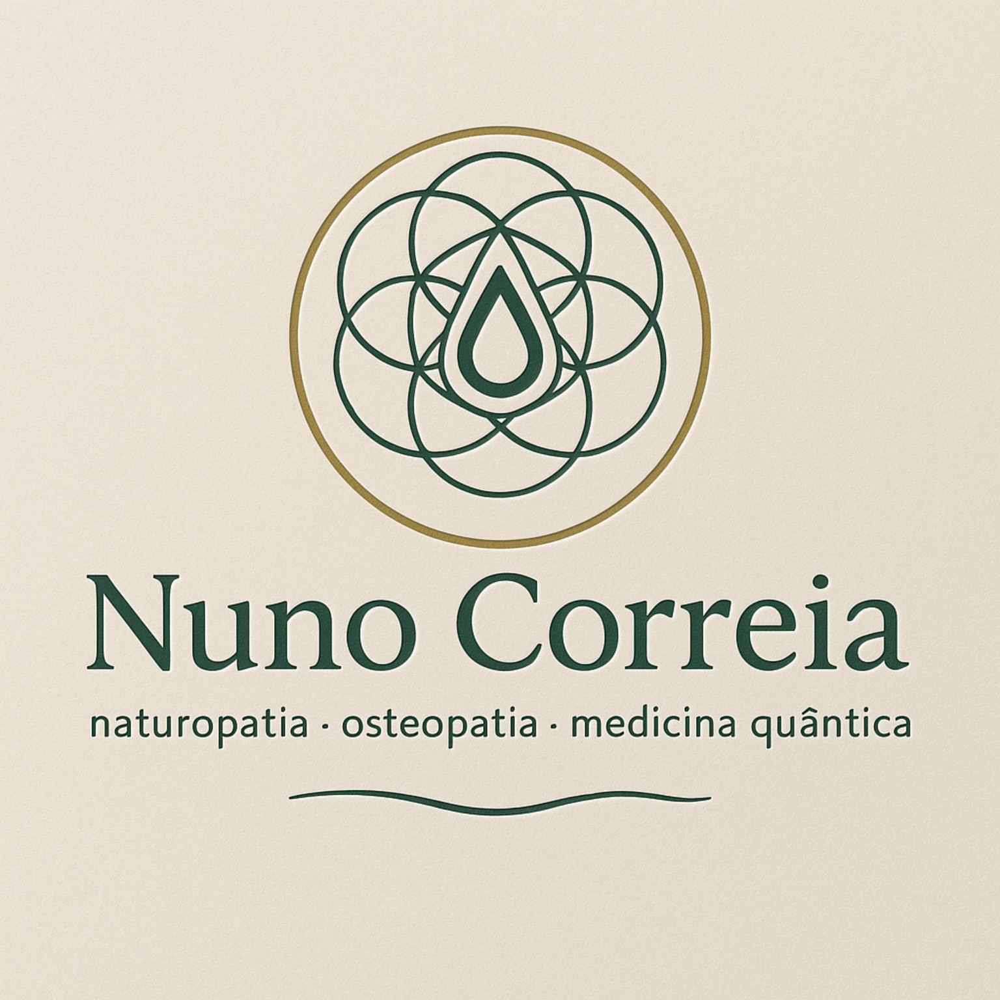

# 🎨 LOGO ATUALIZADO - PRESCRIÇÕES MÉDICAS

## ✅ IMPLEMENTAÇÃO CONCLUÍDA

O logotipo das prescrições médicas foi atualizado com o design circular que você forneceu.

---

## 📁 ARQUIVOS CRIADOS/MODIFICADOS

### 🆕 Novo Logo:
```
📄 assets/logo_prescricao.svg    # Logo SVG com design circular
📄 preview_logo_prescricao.html  # Preview do resultado
```

### 🔧 Arquivo Modificado:
```
📝 templates/prescricao_medica.html  # Template atualizado com novo logo
```

---

## 🎨 CARACTERÍSTICAS DO NOVO LOGO

### **Design:**
- ✅ Padrão geométrico circular ("Flor da Vida")
- ✅ Gota central estilizada
- ✅ Fundo bege claro harmonioso

### **Cores:**
- 🟢 **Verde escuro**: `#2d4a3e` (linhas e texto)
- 🟡 **Dourado**: `#c8a876` (círculo externo)
- 🤍 **Bege claro**: `#f5f7f6` (fundo)
- 🟫 **Cinza médio**: `#5b6b63` (texto secundário)

### **Formato:**
- 📐 **Tamanho**: 110x110 pixels
- 📋 **Formato**: SVG (qualidade perfeita)
- 🖥️ **Responsivo**: Adapta-se bem à impressão e tela

---

## 🔄 ALTERAÇÕES REALIZADAS

### **No Template HTML:**
```html
<!-- ANTES: -->


<!-- DEPOIS: -->

```

### **CSS Otimizado:**
```css
.logo { 
  width: 110px; 
  height: 110px; 
  flex-shrink: 0;  /* Previne redimensionamento */
}

.logo img { 
  width: 100%; 
  height: 100%; 
  object-fit: contain; 
}
```

---

## 🧪 TESTE E VERIFICAÇÃO

### **Comandos de Teste:**
```bash
# Teste completo do sistema
python teste_prescricoes.py

# Resultado: ✅ 6/6 testes passaram
```

### **Preview Visual:**
- Arquivo criado: `preview_logo_prescricao.html`
- Aberto automaticamente no Simple Browser
- Mostra o resultado final da prescrição

---

## 🚀 COMO USAR

### **Na Aplicação:**
1. Executar: `python main_window.py`
2. Ir para: **"Modelos de Prescrição"**
3. Clicar em: **"🩺 Prescrição"**
4. **Resultado**: Logo circular aparece no cabeçalho

### **Características Visuais:**
- Logo posicionado à esquerda no cabeçalho
- Informações do terapeuta à direita
- Linha separadora abaixo
- Layout profissional e harmonioso

---

## 📋 INTEGRAÇÃO COMPLETA

### **Arquivos do Sistema:**
- ✅ **Template HTML**: Atualizado com novo logo
- ✅ **Widget Python**: Funcional sem alterações
- ✅ **Sistema de Testes**: Validado e aprovado
- ✅ **Integração**: Totalmente compatível

### **Compatibilidade:**
- ✅ **Impressão**: Logo aparece corretamente
- ✅ **Tela**: Visualização perfeita
- ✅ **Exportação**: Mantém qualidade
- ✅ **Responsivo**: Adapta-se a diferentes tamanhos

---

**🎉 LOGO IMPLEMENTADO COM SUCESSO - 27/08/2025**

*O novo logotipo circular com o design da "Flor da Vida" está agora integrado nas prescrições médicas, mantendo a identidade visual profissional da marca Nuno Correia.*
